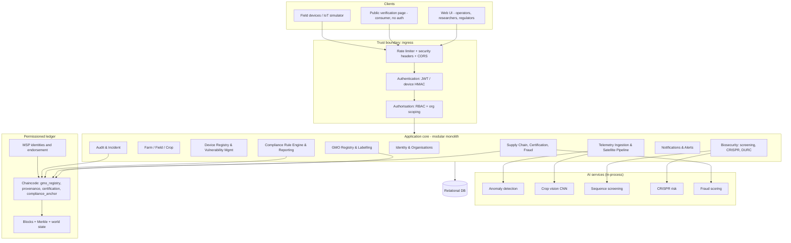

# Architecture.md — System Architecture

**Companion:** `Decision.md` (why), `TRD.md` (with what), `flow.md` (in what order), `Backend.md` (internals).

---

## 1. Architectural drivers

| Driver | Source | Architectural response |
|---|---|---|
| Multi-party trust without a trusted operator | FR-B2, FR-B4, BR-2 | Permissioned ledger with per-organisation signing identities |
| Untrusted edge devices | FR-A1, TB-3 | Separate device credential type, HMAC + nonce, quarantine lifecycle |
| Data segregation between competitors | FR-X3, NFR-13 | Organisation scoping in the data-access layer (ADR-015) |
| Decisions must be explainable to regulators | FR-C2, FR-D3, FR-F1 | Rules-first AI with structured evidence (ADR-012) |
| Must run offline on one machine | C-4, C-5 | Modular monolith, SQLite, in-process ledger |
| Security must be build-time | FR-E1…E3 | CI gates, tests that assert authorisation coverage |

## 2. Logical architecture



## 3. Physical / deployment architecture

**Demo (single machine).** One Uvicorn process serving the API and the static frontend; SQLite
file; ledger state persisted to `ledger_data/`; IoT simulator as a separate local process.

**Local compose.** `api` container + `postgres` container + `iot-simulator` container on a private
bridge network; only the API port published; secrets from `.env`.

**Cloud (documented, Terraform).** ALB → ECS/EKS service (2+ tasks, non-root, read-only rootfs) in
private subnets → RDS PostgreSQL (encrypted, private) ; ECR for images; Secrets Manager for
secrets; S3 for exports/artefacts (SSE-KMS, versioned, public access blocked); CloudWatch logs and
alarms; IAM roles per task with least privilege; security groups deny-by-default.

## 4. Application architecture (layers)

```
HTTP route  →  dependency (authn, authz, org scope, rate limit)
            →  Pydantic request schema (validation at the trust boundary)
            →  service layer (business rules, transactions, audit emission)
            →  repository / ORM (parameterised, org-scoped)
            →  database
                    ↘ ledger client (anchor / verify)
                    ↘ AI service (score / screen)
                    ↘ notification + audit sinks
```

Rules: routers contain no business logic; services never build SQL strings; only services emit
audit records; only the repository layer touches the ORM session.

## 5. Backend module map

| Module | Responsibility | Primary requirements |
|---|---|---|
| `core/` | config, security primitives, errors, logging, rate limiting, deps | FR-X1, FR-X2, NFR-6…9 |
| `identity/` | users, orgs, roles, sessions | FR-X1, FR-X2, FR-X3 |
| `farm/` | farms, fields, crops, planting | FR-B5 |
| `devices/` | registry, provisioning, health, firmware, vulnerabilities | FR-A1, FR-A4, FR-E3 |
| `telemetry/` | ingestion, validation, satellite scenes, encryption at rest | FR-A2 |
| `security_ops/` | data-theft detection, alerts, incidents, quarantine | FR-A3, FR-X4 |
| `biosecurity/` | screening, CRISPR assessment, DURC, hazard DB, review | FR-C1…C4 |
| `gmo/` | events, seed lots, labelling validation | FR-B1, FR-B3 |
| `supplychain/` | products, batches, events, shipments, certifications, fraud | FR-B2, FR-D1…D3 |
| `compliance/` | rule engine, reports, EIA | FR-F1, FR-F2 |
| `verification/` | public QR/reference lookup | FR-D4 |
| `audit/` | hash-chained audit, verification, export | FR-F3, FR-X6 |
| `ledger_client/` | anchor, verify, query world state | FR-B4 |

## 6. Data architecture

Entities and relationships are specified in `Backend.md` §4 and the ER diagram there. Principles:

* Every business table carries `id (uuid)`, `created_at`, `updated_at`, `created_by`, and where
  relevant `org_id` for tenancy.
* Soft deletion (`deleted_at`) is used **only** for user-facing catalogue entities. Traceability
  and audit tables are append-only: nothing is ever deleted or updated in place.
* Content-addressed anchoring: `content_hash`, `tx_id`, `block_number` on anchored entities.
* Indexes on every foreign key, on `(org_id, created_at)` for list views, and on
  `(device_id, recorded_at)` for telemetry.
* Sensitive payload columns are encrypted with AES-GCM at the application layer.

## 7. AI architecture

```
Input (typed schema)
  → feature extraction (deterministic, versioned)
  → model or rule evaluation
  → score + threshold from configuration
  → structured verdict {score, level, reasons[], evidence{}, model_version}
  → persisted analysis record → optional alert → optional ledger anchor
```

Models are loaded lazily, cached in-process, and versioned by a `model_card.json`. If a model
artefact is missing or fails to load, the service degrades to its rule-only path and emits a
`WARNING` — it never returns a 5xx to a caller doing unrelated work (NFR-5).

## 8. IoT architecture

```
Device (simulated) ──HTTP+HMAC(nonce,ts)──► /api/v1/telemetry/ingest
        │                                      │
        │                                      ├─ verify device exists, active, not quarantined
        │                                      ├─ verify HMAC over canonical payload
        │                                      ├─ verify timestamp window + nonce unseen
        │                                      ├─ validate schema + physical ranges
        │                                      ├─ persist (payload encrypted at rest)
        │                                      ├─ score anomaly → alert if above threshold
        │                                      └─ update device health/last_seen
        └── offline buffer → batch replay with per-message nonces
```

Gateway model, provisioning, certificates and lifecycle are detailed in `IoT-Devices.md`.

## 9. Blockchain architecture

Four organisations (`BiotechMSP`, `FarmMSP`, `SupplyMSP`, `RegulatorMSP`), each with an ECDSA
P-256 key pair. Transaction lifecycle: **propose → endorse (per contract policy) → order → block →
commit to world state**. Blocks are SHA-256 hash-linked and carry a Merkle root over their
transactions, enabling inclusion proofs. Full detail, contract signatures, and the Fabric migration
mapping are in `Blockchain-integration.md`.

## 10. Security architecture

Defence in depth at seven layers — ingress (headers, CORS, rate limit), identity (bcrypt, JWT,
lockout), authorisation (RBAC + tenancy in the data layer), input (Pydantic + domain range checks),
data (AES-GCM at rest, TLS in transit, no secrets in logs), integrity (hash chains, ledger
anchoring, audit), and supply chain (CI scanning, SBOM, pinned images). Full threat model in
`Security.md`.

## 11. DevSecOps architecture

```
commit → pre-commit (format, lint, secret scan, fast tests)
  → CI: lint → unit → SAST(Bandit,Semgrep) → SCA(pip-audit) → secrets(Gitleaks)
       → build image → Trivy scan → integration + E2E + security tests
       → IaC scan (Checkov/tfsec) → SBOM (CycloneDX) → DAST (ZAP baseline)
       → publish to registry → deploy → smoke tests → monitor
```

Gates: any HIGH/CRITICAL finding in SAST, SCA, secrets, or container scanning fails the build.

## 12. Cross-cutting concerns

| Concern | Mechanism |
|---|---|
| Correlation | `X-Request-ID` generated or propagated; present in every log line and error response |
| Errors | Single exception hierarchy → RFC-7807-style JSON; internal detail never leaked |
| Config | Environment only, validated at start-up; production refuses insecure defaults |
| Time | UTC everywhere; ISO-8601 at the boundary |
| Idempotency | Device telemetry keyed by `(device_id, nonce)`; ledger transactions by content hash |
| Degradation | Ledger/AI failures are captured, alarmed, and surfaced as partial results, not 5xx |
| Ingestion cost | Anomaly scoring dominates the telemetry path (6.5–10 ms/message versus under 0.03 ms for every security control). `TELEMETRY_INLINE_SCORING=false` defers it to a background task — see PRD.md NFR-2 |
