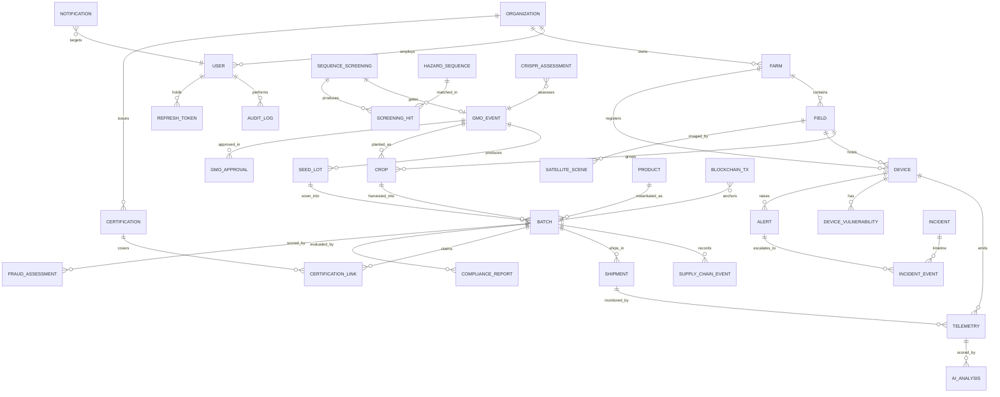

# Backend.md — Backend Design and Data Model

Implementation lives in `backend/app/`. This document is the design of record for it.

---

## 1. Backend architecture

FastAPI modular monolith (ADR-001), layered as
`router → dependency (authn/authz/scope) → schema → service → repository → ORM → DB`,
with side channels to the ledger client, AI services, notification and audit sinks.

```
backend/app/
├── main.py               app factory, middleware, exception handlers, static mounting
├── core/
│   ├── config.py         typed settings from environment, production safety checks
│   ├── database.py       engine, session, FK pragma, session dependency
│   ├── security.py       bcrypt, JWT issue/verify, device HMAC, AES-GCM, token store
│   ├── permissions.py    role → permission matrix
│   ├── deps.py           current principal, require_permission, scoped_query, rate limit
│   ├── errors.py         exception hierarchy + RFC-7807 handlers
│   ├── logging_conf.py   JSON logging, redaction filter, correlation id
│   └── ratelimit.py      token-bucket limiter (per identity and per IP)
├── models.py             SQLAlchemy 2.0 ORM models (26 tables)
├── schemas.py            Pydantic request/response models
├── repositories.py       org-scoped data access helpers
├── services/             business logic per module
│   ├── identity.py devices.py telemetry.py security_ops.py biosecurity.py
│   ├── gmo.py supplychain.py compliance.py audit.py notifications.py
└── routers/              one router per module, ~90 routes total
```

## 2. Services and responsibilities

| Service | Key operations |
|---|---|
| `identity` | register, approve, login, refresh, rotate, lockout, user CRUD, org CRUD |
| `devices` | register, provision secret, activate, health update, quarantine, retire, firmware/vulnerability inventory |
| `telemetry` | authenticated ingest, batch ingest, validation, encryption, satellite scenes, series queries |
| `security_ops` | access recording, data-theft scoring, alerts, incidents, containment actions |
| `biosecurity` | sequence screening, review workflow, CRISPR assessment, DURC flagging, hazard DB |
| `gmo` | transformation events, seed lots, labelling validation, approval jurisdictions |
| `supplychain` | products, batches, EPCIS events, shipments, certifications, custody chain, fraud, verification |
| `compliance` | rule engine, evaluations, reports, environmental impact assessments |
| `audit` | hash-chained append, verification, export, ledger anchoring of the head |
| `notifications` | fan-out by role and category, acknowledge, list |

## 3. Cross-cutting middleware order

```
CorrelationId → SecurityHeaders → CORS(allow-list) → BodySizeLimit → RateLimit
→ AccessRecorder(data-theft signals) → route
```

## 4. Data model

26 tables. `id` is a UUID string primary key everywhere; all tables carry `created_at`;
mutable tables carry `updated_at`; tenant tables carry `org_id`.

### Entity–relationship diagram



### Table catalogue

| # | Table | Purpose | Notable columns |
|---|---|---|---|
| 1 | `organizations` | Tenant + blockchain participant | `msp_id`, `org_type`, `trusted_issuer` |
| 2 | `users` | Accounts | `email`, `password_hash`, `role`, `status`, `failed_attempts`, `locked_until` |
| 3 | `refresh_tokens` | Rotation + reuse detection | `jti`, `family_id`, `revoked`, `expires_at` |
| 4 | `farms` | Farm | `region`, `country`, `latitude`, `longitude`, `area_ha` |
| 5 | `fields` | Field within a farm | `area_ha`, `soil_type`, `boundary_geojson` |
| 6 | `crops` | Planting on a field | `crop_type`, `variety`, `gmo_event_id`, `planted_at`, `expected_harvest` |
| 7 | `devices` | Device registry | `device_type`, `secret_enc`, `status`, `firmware_version`, `last_seen_at`, `battery`, `signal` |
| 8 | `device_vulnerabilities` | FR-E3 inventory | `cve_id`, `severity`, `status`, `fixed_in` |
| 9 | `telemetry` | Time-series readings | `device_id`, `recorded_at`, `payload_enc`, `nonce`, `anomaly_score`, `shipment_id` |
| 10 | `satellite_scenes` | Imagery metadata | `scene_id`, `ndvi_mean`, `cloud_cover`, `checksum` |
| 11 | `ai_analyses` | Any AI verdict | `analysis_type`, `subject_type`, `subject_id`, `score`, `level`, `reasons`, `model_version` |
| 12 | `alerts` | Security/agronomy alerts | `category`, `severity`, `status`, `entity_type`, `entity_id` |
| 13 | `incidents` | Response records | `severity`, `status`, `root_cause`, `opened_by` |
| 14 | `incident_events` | Timeline | `incident_id`, `action`, `actor_id` |
| 15 | `hazard_sequences` | Screening reference DB | `agent_name`, `hazard_class`, `severity`, `sequence` |
| 16 | `sequence_screenings` | Screening submissions | `sequence_enc`, `verdict`, `max_identity`, `status`, `reviewed_by` |
| 17 | `screening_hits` | Alignment evidence | `hazard_id`, `identity`, `align_len`, `query_start`, `subject_start`, `score` |
| 18 | `crispr_assessments` | Gene-edit risk | `guide_rna`, `pam`, `off_target_count`, `risk_level`, `durc_flag` |
| 19 | `gmo_events` | Transformation events | `event_code`, `crop_type`, `trait`, `donor_organism`, `screening_id`, `content_hash`, `tx_id` |
| 20 | `gmo_approvals` | Jurisdictional approvals | `jurisdiction`, `status`, `approved_at`, `reference` |
| 21 | `seed_lots` | Seed production | `lot_code`, `gmo_event_id`, `quantity_kg`, `producer_org_id` |
| 22 | `products` | Trade items | `gtin`, `name`, `category`, `organic_claim`, `non_gmo_claim` |
| 23 | `batches` | Traceable units | `batch_code`, `verification_code`, `state`, `quantity` (current), `initial_quantity` (immutable, anchored), `unit`, `parent_batch_id` |
| 24 | `supply_chain_events` | EPCIS-shaped events | `event_type`, `biz_step`, `disposition`, `location_gln`, `quantity`, `content_hash`, `tx_id` |
| 25 | `shipments` | Logistics | `sscc`, `origin`, `destination`, `departed_at`, `arrived_at`, `temp_min`, `temp_max` |
| 26 | `certifications` + `certification_links` | Claims and their scope | `cert_type`, `standard`, `valid_from`, `valid_to`, `status`, `issuer_org_id` |
| 27 | `compliance_reports` | Rule evaluations | `jurisdiction`, `status`, `results`, `content_hash`, `tx_id` |
| 28 | `fraud_assessments` | Fraud scoring | `score`, `level`, `reasons`, `model_version` |
| 29 | `blockchain_txs` | Anchor index | `tx_id`, `block_number`, `contract`, `function`, `content_hash`, `entity_type`, `entity_id` |
| 30 | `audit_logs` | Hash-chained audit | `seq`, `prev_hash`, `entry_hash`, `actor_id`, `action`, `entity`, `ip`, `correlation_id` |
| 31 | `notifications` | User inbox | `user_id`, `severity`, `title`, `body`, `read_at` |
| 32 | `access_records` | Data-theft signals | `principal_id`, `route`, `page_size`, `hour`, `entity_scope` |

(The ER diagram shows the principal relationships; link and index tables are listed in the
catalogue.)

### Indexes and constraints

* Unique: `users.email`, `organizations.msp_id`, `devices.id`, `gmo_events.event_code`,
  `batches.batch_code`, `batches.verification_code`, `products.gtin`, `blockchain_txs.tx_id`,
  `audit_logs.seq`, `(telemetry.device_id, telemetry.nonce)`.
* Indexes: every FK; `(org_id, created_at)` on tenant tables; `(device_id, recorded_at)` on
  telemetry; `(status, severity)` on alerts; `(batch_id, occurred_at)` on supply-chain events.
* Checks: quantities ≥ 0; `valid_to > valid_from`; enumerated columns constrained in the
  application layer (portable across SQLite/PostgreSQL).
* Foreign keys enforced (`PRAGMA foreign_keys=ON` on SQLite).

### Soft deletion

Only `products`, `farms`, `fields`, `devices` and `users` carry `deleted_at`, and the scoped
repository filters it automatically. Traceability tables (`supply_chain_events`, `telemetry`,
`blockchain_txs`, `audit_logs`, `screening_hits`) are append-only: no delete endpoint exists.

### Audit fields

`created_at`, `updated_at`, `created_by` on business tables; the audit log records the mutation
separately with before/after summaries.

### Migrations and seed data

Two mechanisms, with different jobs (ADR-014 — plain SQL migrations, no Alembic):

* **New database.** `create_all()` in `backend/app/core/database.py` builds the full 34-table
  schema from the SQLAlchemy models. This is the path `seed_demo.py`, the test fixtures and a
  fresh container all take. There is deliberately **no `0001_init.sql`**: an init file would be a
  second, hand-maintained definition of a schema the models already define, and the two would
  drift.
* **Existing database.** `backend/migrations/run.py` is a forward-only runner that applies each
  numbered `.sql` file in `backend/migrations/` exactly once and records the version in the
  `schema_version` table. `--status` lists applied and pending versions. Currently one migration
  exists: `0001_screening_reasons.sql`, which adds the `sequence_screenings.reasons` column and
  backfills existing rows to `'[]'`.

Because SQLite cannot add a `NOT NULL` column with `ALTER TABLE`, a database created by
`create_all()` has `reasons NOT NULL` while one upgraded by the migration leaves it nullable. The
`ScreeningDetail` serialiser coerces `NULL` to `[]` so both paths read identically.

`scripts/seed_demo.py` creates 4 organisations, 9 users, 3 farms, 9 fields, 13 devices, 4 device
vulnerabilities, a 10-record hazard database, 3 products and 2 certifications, and then drives the
real service paths to produce 78 telemetry readings across all six device classes, 6
checksum-verified satellite scenes and 82 AI analyses. Everything it writes is marked as demo
data. `scripts/demo_flow.py` layers the GMO, supply-chain and biosecurity story on top.

## 5. Business logic highlights

* **Lifecycle validation.** Batch state transitions are checked against a transition table;
  an illegal transition is a 422 with the allowed set.
* **Quantity conservation.** A processing event may not output more than its input; declared loss
  must be explicit and is recorded.
* **Labelling validation.** GMO content above the jurisdiction threshold requires a label; a
  `NON_GMO` claim on a batch whose lineage contains a GMO event is rejected.
* **Screening gate.** A GMO event cannot be registered without a screening in a passing state.
* **Certification gate.** Issuance requires the issuer organisation to be a trusted issuer for
  that certification type.

## 6. Validation, error handling, logging

Pydantic at the boundary; domain validators in services; a single exception hierarchy mapped to
RFC-7807 responses with a correlation id; JSON logs with redaction; three log streams
(application, security, audit).

## 7. Events and background jobs

`BackgroundTasks` for: anomaly scoring on ingest, audit anchoring, notification fan-out, and
expiry sweeps (certifications approaching expiry, devices silent beyond their interval). A
scheduler entry point (`scripts/scheduled_tasks.py`) runs the sweeps for the demo.

## 8. Integrations

* **Ledger client** — `ledger_client/` wraps `ledger/` with retry and circuit-breaking; failures
  degrade to `anchor_pending` rather than failing the business operation.
* **AI services** — imported from `ai/`; lazily loaded, cached, with a rule-only fallback path.
* **IoT** — inbound only, via the authenticated ingestion routes.
* **Notifications** — in-app; webhook/email documented as the production path.
