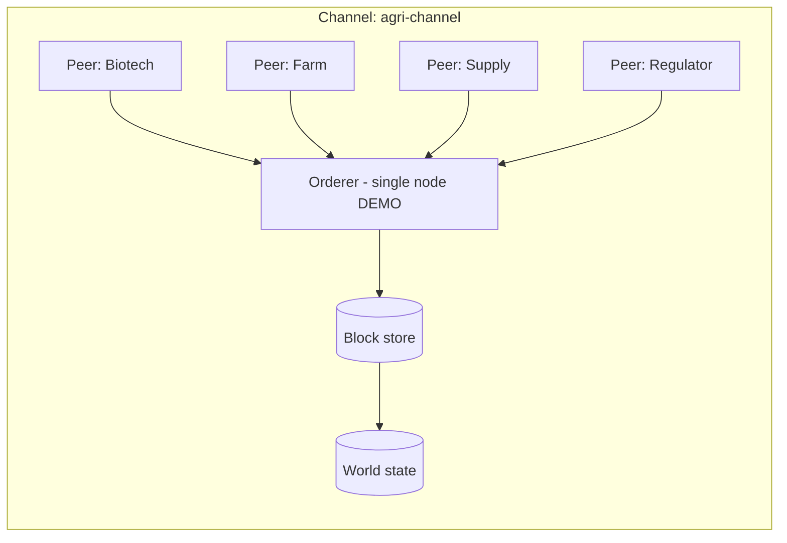

# Blockchain-integration.md — Permissioned Ledger Design and Integration

Satisfies FR-B1, FR-B2, FR-B4, FR-D1, FR-F3. Implementation: `ledger/` package and
`backend/app/services/*` call sites.

**Marking.**
**REAL IMPLEMENTATION:** ECDSA P-256 transaction signing and verification, SHA-256 hash-linked
blocks, Merkle roots and inclusion proofs, MSP identity registry, endorsement policy evaluation,
world state, chaincode-style contracts, chain verification and tamper detection.
**DEMO/SIMULATION:** single-node ordering. There is no multi-peer gossip, no Raft cluster, and no
independent physical custody of the ledger by each organisation.
This is stated in the UI, in the API responses (`"network": "single-node-demo"`), and in the final
report. Rationale and rejected alternatives: ADR-003.

---

## 1. Why a blockchain is architecturally justified here

Blockchain is not added because the project title contains the word. It is used only for data with
these properties:

| Property required | Data that has it | Data that does not |
|---|---|---|
| Immutability | GMO event registration, custody transfers, certification issuance/revocation, compliance report hashes | Raw telemetry, imagery, user profiles |
| Shared trust across mutually distrusting parties | Biotech ↔ Farm ↔ Processor ↔ Regulator handovers | Internal farm operations |
| Non-repudiation of a claim | "This batch was certified organic on this date by this issuer" | Dashboard preferences |
| Independent verifiability by an outsider | Consumer/regulator verification of provenance | Device battery level |

Everything else stays in the relational database. High-volume telemetry is deliberately **not**
written to the ledger: it would bloat the chain and leak commercially sensitive data with no
integrity benefit that a digest cannot provide.

## 2. Platform choice

Hyperledger Fabric's model, implemented in-process (ADR-003). The choice preserves: permissioned
membership via MSPs, endorsement before ordering, chaincode-style contracts with a read/write set,
world state separate from the transaction log, and channel-style isolation (one channel,
`agri-channel`, in this deployment).

## 3. Network architecture



## 4. Participants and identity model

| Organisation | MSP ID | Key | Rights |
|---|---|---|---|
| Seed/Biotech company | `BiotechMSP` | ECDSA P-256 | Register GMO events and seed lots |
| Farm cooperative | `FarmMSP` | ECDSA P-256 | Record planting, harvest, farm custody |
| Processor/Distributor | `SupplyMSP` | ECDSA P-256 | Record processing, packaging, shipment, receipt |
| Regulator/Certifier | `RegulatorMSP` | ECDSA P-256 | Issue/revoke certifications, endorse compliance anchors, read all |

Identities are generated at first run into `ledger_data/msp/` (git-ignored). Each organisation has
a private key and a registered public key; every transaction is signed by its submitter and by each
endorser.

## 5. Smart contracts (chaincode-style)

| Contract | Function | Args | Endorsement policy | Writes |
|---|---|---|---|---|
| `gmo_registry` | `RegisterEvent` | event_code, crop, trait, donor, developer, screening_hash | `BiotechMSP AND RegulatorMSP` | `gmo:{event_code}` |
| `gmo_registry` | `RecordApproval` | event_code, jurisdiction, status, reference | `RegulatorMSP` | `gmoapproval:{event_code}:{jur}` |
| `gmo_registry` | `RegisterSeedLot` | lot_code, event_code, quantity, producer | `BiotechMSP` | `seedlot:{lot_code}` |
| `provenance` | `CreateBatch` | batch_code, product, origin, quantity, parents[] | `FarmMSP OR SupplyMSP` | `batch:{batch_code}` |
| `provenance` | `RecordEvent` | batch_code, biz_step, disposition, location, quantity, content_hash | `FarmMSP OR SupplyMSP` | `event:{id}`, updates `batch` state |
| `provenance` | `TransferCustody` | batch_code, from_org, to_org, timestamp | `from_org AND to_org` | `batch:{batch_code}.custodian` |
| `certification` | `Issue` | cert_id, type, standard, subject, valid_from, valid_to, issuer | `RegulatorMSP` | `cert:{cert_id}` |
| `certification` | `Revoke` | cert_id, reason | `RegulatorMSP` | `cert:{cert_id}.status` |
| `compliance_anchor` | `AnchorReport` | report_id, subject, jurisdiction, status, content_hash | `RegulatorMSP OR SupplyMSP` | `report:{report_id}` |
| `compliance_anchor` | `AnchorAuditHead` | seq, head_hash | any | `audithead:latest` |

Every contract validates: submitter organisation is authorised for the function, referenced state
exists, the state transition is legal, quantities are conserved, and identifiers are unique.
A contract that fails validation returns an error and **no** block is produced.

## 6. Transaction structure

```json
{
  "tx_id": "sha256(canonical(payload))",
  "channel": "agri-channel",
  "contract": "provenance",
  "function": "RecordEvent",
  "args": {"...": "..."},
  "submitter": {"msp_id": "SupplyMSP", "identity": "supply-signer-1"},
  "timestamp": "2026-09-03T10:15:00Z",
  "read_set": ["batch:B-2026-0007"],
  "write_set": {"event:...": {"...": "..."}},
  "endorsements": [{"msp_id": "SupplyMSP", "signature": "<ECDSA P-256 DER, hex>"}],
  "signature": "<submitter ECDSA P-256, hex>"
}
```

`tx_id` is the content hash, which makes replay of an identical transaction a detectable duplicate.

## 7. Block structure

```json
{
  "number": 42,
  "previous_hash": "…",
  "timestamp": "…",
  "transactions": ["…"],
  "merkle_root": "…",
  "block_hash": "sha256(number || previous_hash || merkle_root || timestamp)"
}
```

Genesis block number 0 has `previous_hash` of 64 zeros and carries the MSP registration.

## 8. On-chain vs off-chain (ADR-011)

| On-chain | Off-chain (database) |
|---|---|
| Identifiers (event codes, batch codes, cert ids, report ids) | Full records and free-text fields |
| State transitions and custodian changes | Raw telemetry and imagery |
| Content hashes (SHA-256) of the off-chain record | Personal data of any kind |
| Participant MSP ids and timestamps | Commercial terms, prices, contracts |
| Certification status | Certificate PDFs and evidence files |

## 9. Hashing strategy

Canonical JSON (sorted keys, no whitespace, UTF-8) → SHA-256 → hex. The same function computes
entity content hashes, transaction ids and audit-chain entries, so any party can reproduce a hash
independently. Merkle trees use SHA-256 with duplication of the last leaf for odd counts.

## 10. Events

The ledger emits `TransactionCommitted`, `BlockCommitted` and per-contract events
(`GMOEventRegistered`, `BatchCreated`, `CustodyTransferred`, `CertificationIssued`,
`CertificationRevoked`, `ComplianceAnchored`). The backend subscribes to update the
`blockchain_txs` index and to fan out notifications.

## 11. Transaction lifecycle

`propose → simulate (read/write set) → endorse per policy → sign → order → cut block → commit
world state → index in the database → emit event`. If endorsement fails, the caller receives a
domain error and the business record is stored with `anchor_status = FAILED`, which is visible in
the UI and retried by a sweep — the business operation is not lost because the ledger was
unavailable (NFR-5).

## 12. Verification

| Endpoint | What it proves |
|---|---|
| `GET /api/v1/blockchain/verify` | Whole-chain replay: parent hashes, Merkle roots, every signature. Reports the first divergent block. |
| `GET /api/v1/blockchain/transactions/{tx_id}/proof` | Merkle inclusion proof for one transaction |
| `POST /api/v1/blockchain/verify-record` | Recomputes an entity's content hash and compares it with the anchored value: `MATCH` / `MISMATCH` / `NOT_ANCHORED` |
| `GET /api/v1/blockchain/state/{key}` | Current world-state value |
| `GET /api/v1/verify/{code}` | Public, consumer-facing provenance with ledger verification status |

A tamper demonstration is included in the demo script: a database row is altered directly and the
verification endpoint reports `MISMATCH` while identifying the affected transaction.

## 13. Failure handling

Ledger unavailability, endorsement failure and contract validation errors are distinct error types.
The ledger client applies bounded retries with backoff and a circuit breaker; on open circuit,
anchoring is queued (`anchor_status = PENDING`) and swept later. No business write is rolled back
because of an anchoring failure, and the pending state is visible rather than silent.

## 14. Key management

Demo keys are generated locally into `ledger_data/msp/` and are git-ignored. Production: private
keys in a KMS/HSM with per-organisation custody, certificate-based identities issued by a Fabric CA,
rotation with overlapping validity, and no key material on application hosts.

## 15. Smart-contract security

Authorisation on every function; strict input typing; no floating-point arithmetic for quantities
(decimal strings); duplicate-identifier rejection; explicit state-machine validation; no external
calls; deterministic execution (no clocks or randomness inside contract logic — timestamps are
supplied and validated by the orderer). Contract-level tests cover the unauthorised-caller, replay,
illegal-transition and quantity-violation cases.

## 16. Local development and testing

The ledger starts automatically with the API — no container, no external network. `pytest
backend/tests/test_ledger.py` covers genesis, append, hash linkage, Merkle proofs, signature
verification, endorsement-policy enforcement, tamper detection and world-state consistency.
`scripts/ledger_explorer.py` prints blocks and transactions for the demonstration.

## 17. Migration path to production Hyperledger Fabric

1. Deploy Fabric 2.5 with four organisations, one channel (`agri-channel`), Raft ordering (3+
   orderers) and a Fabric CA per organisation.
2. Port each contract to Go or Node chaincode. The mapping is one-to-one because the contract
   interface is already `(function_name, args, submitter_identity) → read/write set`:

   | Our contract.function | Fabric chaincode |
   |---|---|
   | `gmo_registry.RegisterEvent` | `gmoregistry:RegisterEvent` |
   | `provenance.RecordEvent` | `provenance:RecordEvent` |
   | `certification.Issue` | `certification:Issue` |
   | `compliance_anchor.AnchorReport` | `compliance:AnchorReport` |

3. Replace `ledger/client.py` with the Fabric Gateway SDK client. The backend's call sites use only
   `submit()`, `query()` and `verify()`, so no service code changes.
4. Move endorsement policies from our policy table into channel/chaincode endorsement policy
   definitions (identical AND/OR semantics).
5. Replace local MSP files with Fabric CA-issued X.509 identities held per organisation.
6. Re-anchor or replay historical hashes into the production channel and re-run verification.

**Estimated effort:** the isolation of the ledger interface is deliberate so that this is a
contained change to one package plus chaincode authoring, not a rewrite of the platform.
