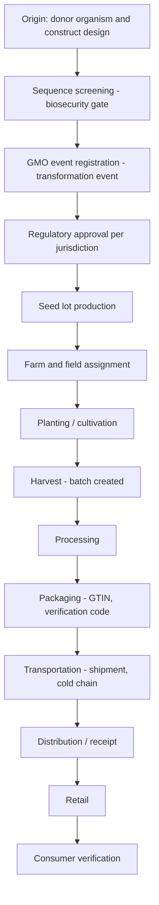

# GMO.md — GMO and Biotechnology Traceability Architecture

Satisfies FR-B1, FR-B3, FR-B5, FR-C1…C4, FR-D1…D4. Implementation:
`backend/app/services/gmo.py`, `services/biosecurity.py`, `services/supplychain.py`,
`ai/sequence_screening.py`, `ai/crispr_risk.py`, `ledger/contracts.py`.

---

## 1. Lifecycle model

The specification requires provenance "from seed development through distribution". The
implemented lifecycle is:



Not every batch traverses every stage; the architecture represents the complete chain and each
batch records the stages it actually passed through. A gap in the chain is a first-class finding
(`custody_gap`) rather than a silent omission.

## 2. Identity model

| Identity | Format | Example | Notes |
|---|---|---|---|
| GMO transformation event | OECD-style unique identifier | `ABS-Ø1234-5` | Validated by pattern; unique |
| Seed lot | `SL-<year>-<seq>` | `SL-2026-000123` | Links to one GMO event |
| Batch | `B-<year>-<seq>` | `B-2026-004501` | May have parent batches (splits/merges) |
| Product | GS1 GTIN-14 | `09501101530003` | Check digit validated |
| Shipment | GS1 SSCC | `003123450000000017` | Logistic unit |
| Location | GS1 GLN | `9501101530003` | Where events occur |
| Verification code | 128-bit opaque, base32 | `K7QF-2M9X-…` | Public QR target, unguessable |

## 3. Biosecurity gate before registration (FR-C1)

No GMO event may be registered without a sequence screening in a passing state. Screening:

```
query sequence (≤ 100 kb, alphabet-validated)
  → k-mer index (k = 11) over the hazard database
  → seed hits → ungapped extension → Smith-Waterman local alignment around each seed
  → per-hit: identity %, alignment length, query/subject coordinates, score
  → aggregate: max identity, hazard classes matched, coverage
  → verdict:
       identity ≥ 90% and align_len ≥ 60   → BLOCK    (high-confidence hazard homology)
       identity ≥ 75% and align_len ≥ 40   → FLAG     (review required)
       otherwise                            → CLEAR
  → severity of the matched agent raises the verdict one level
```

The hazard database (`hazard_sequences`) carries agent name, hazard class
(`PLANT_PATHOGEN`, `TOXIN`, `ANTIBIOTIC_RESISTANCE`, `VIRULENCE_FACTOR`, `DUAL_USE_MARKER`) and a
severity (1–5). **The hazard sequences shipped in this repository are synthetic motifs, not real
pathogen sequences** — publishing a real hazard database would itself be a biosecurity concern, and
the algorithm is what is being demonstrated (ADR-013).

Only a human `BIOSAFETY_OFFICER` can release a `BLOCKED` screening; the release is audited.

## 4. CRISPR risk assessment (FR-C2)

Inputs: target gene, guide RNA (17–25 nt), PAM, organism, edit type
(`KNOCKOUT | KNOCK_IN | BASE_EDIT | PRIME_EDIT | MULTIPLEX`), intent.

```
validate guide length and PAM compatibility
off-target scan: k-mer seeded search over the organism reference with ≤ 3 mismatches,
                 PAM-adjacent weighting (seed region mismatches penalised more)
risk score = w1·target_criticality + w2·edit_type_weight + w3·f(off_target_count)
           + w4·organism_class + w5·intent_weight
verdict: LOW < 0.35 ≤ MODERATE < 0.6 ≤ HIGH < 0.85 ≤ PROHIBITED
```

Every component of the score is returned in `reasons[]` so a biosafety officer sees exactly why
(ADR-012). HIGH and PROHIBITED are queued for review and notified.

## 5. Dual-use research monitoring (FR-C3)

A concern matrix correlates hazard class × intent × technique:

| Hazard class | Intent | Technique | Outcome |
|---|---|---|---|
| `PLANT_PATHOGEN` | virulence enhancement | any | DURC — block, notify |
| `PLANT_PATHOGEN` | host-range expansion | any | DURC — block, notify |
| `TOXIN` | expression increase | any | DURC — block, notify |
| `ANTIBIOTIC_RESISTANCE` | marker insertion | knock-in | Flag — review |
| any | resistance to control agents | any | Flag — review |
| benign | research | any | Clear |

Flagged submissions create a `crispr_assessments.durc_flag` record, notify the biosafety officer
and the regulator role, and are audit-logged.

## 6. Registration and approval (FR-B1)

`POST /api/v1/gmo/events` requires: a passed screening, an OECD-format event code, crop, trait,
donor organism, developer organisation. On success the event is anchored via
`gmo_registry.RegisterEvent` (endorsed by `BiotechMSP AND RegulatorMSP`).

Approvals are recorded per jurisdiction (`US-USDA`, `US-FDA`, `EU`, `CODEX`) with status
(`APPROVED | PENDING | REJECTED | NOT_SUBMITTED`), date and reference, anchored by
`gmo_registry.RecordApproval`.

## 7. Provenance and chain of custody (FR-B2)

Every stage transition is an EPCIS-shaped supply-chain event:

```json
{
  "what":  {"batch_code": "B-2026-004501", "quantity": 12000, "unit": "kg"},
  "when":  "2026-09-03T08:00:00Z",
  "where": {"location_gln": "9501101530003", "name": "Processing plant A"},
  "why":   {"biz_step": "commissioning|packing|shipping|receiving|transforming",
             "disposition": "in_progress|in_transit|in_storage|sellable_accessible"},
  "who":   {"org_id": "...", "msp_id": "SupplyMSP"}
}
```

Custody transfer requires endorsement by both the sending and receiving organisations, which is
what makes the chain trustworthy across parties rather than merely recorded.

Batch lineage supports splits and merges through `parent_batch_id`, so a packaged retail unit can
be traced back through processing and harvest to a seed lot and a GMO event.

## 8. Labelling compliance validation (FR-B3)

| Rule | Jurisdiction | Logic |
|---|---|---|
| GMO disclosure threshold | EU (1829/2003) | GMO content > 0.9 % of the batch lineage requires a label |
| Bioengineered food disclosure | US (USDA BE) | Detectable modified genetic material requires disclosure |
| `NON_GMO` claim conflict | all | A `NON_GMO` certification on a batch whose lineage contains a GMO event is rejected |
| `ORGANIC` claim conflict | US NOP / EU organic | Organic excludes GMO lineage |
| Approval before release | all | The GMO event must be `APPROVED` in the destination jurisdiction |
| Traceability identifier | EU | The unique identifier must accompany the product through the chain |

Failures block the release and produce a citable rule reference in the compliance report.

## 9. Certifications (FR-D2)

Types: `ORGANIC`, `NON_GMO`, `SPECIALTY` (e.g. protected designation, fair trade, halal/kosher
class), each with a standard reference (`USDA-NOP`, `EU-834/2007`, `NON-GMO-PROJECT`, `CODEX-GL-32`).
Authentication at use time verifies status, validity window, issuer trust, scope coverage of the
specific batch, and absence of conflicts. Issuance and revocation are anchored on the ledger, so a
revoked certificate cannot be presented later as valid.

## 10. Food fraud detection (FR-D3)

| Signal | Rule |
|---|---|
| `quantity_mismatch` | Output quantity exceeds input, or unexplained loss > 10 % |
| `custody_gap` | A required stage is missing between two recorded stages |
| `timeline_inconsistency` | Events out of chronological order, or an impossible dwell time |
| `impossible_transit` | Distance ÷ elapsed time implies an implausible speed |
| `expired_certification` | A claim is made outside its certificate's validity window |
| `revoked_certification` | The certificate was revoked before the claim |
| `claim_conflict` | `NON_GMO` or `ORGANIC` claimed on GMO lineage |
| `cold_chain_break` | Linked shipment telemetry shows an excursion beyond the product's limits |
| `ledger_mismatch` | A stored record's content hash does not match its anchor |
| `duplicate_batch_code` | The same batch code appears in two custody chains |

Rules produce the explainable component of the score; an `IsolationForest` over event features adds
the novelty component. Verdicts: `VERIFIED` (< 0.3), `SUSPECT` (0.3–0.7), `FAILED` (> 0.7).

## 11. Consumer verification (FR-D4)

`GET /api/v1/verify/{verification_code}` — unauthenticated, rate-limited, returns product name and
category, GMO status and event code where applicable, certification claims with their validity,
coarse origin (region and country, never coordinates or farmer identity), the journey stages with
dates, and the ledger verification result. A QR code encoding the public verify URL is generated
server-side as an SVG using the standard library — no external service, no third-party dependency.

## 12. Audit history

Every GMO and supply-chain mutation writes an audit record (actor, action, entity, before/after
summary) into the hash-chained audit log, and the chain head is periodically anchored to the
ledger. `GET /api/v1/gmo/events/{id}/history` and `GET /api/v1/supply-chain/batches/{id}/history`
return the reconstructed history with each entry's ledger anchor status.
