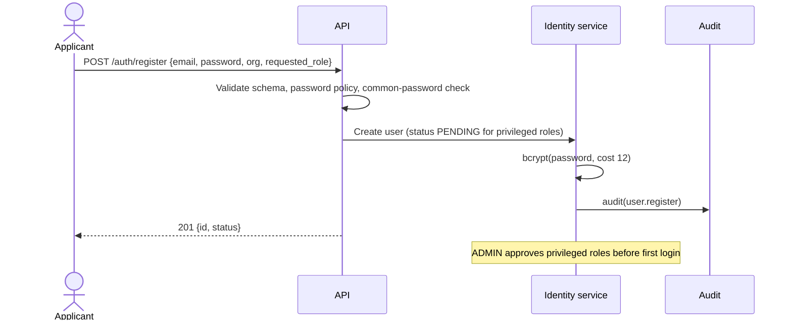
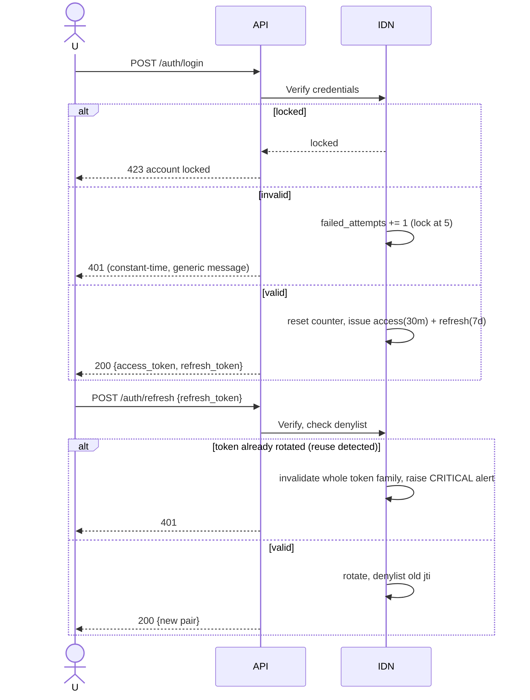
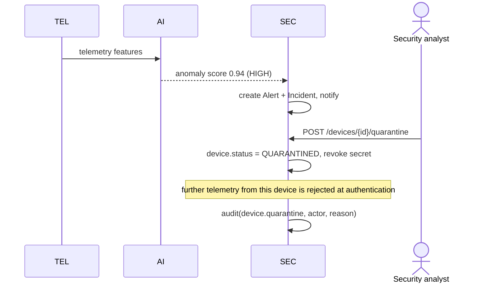
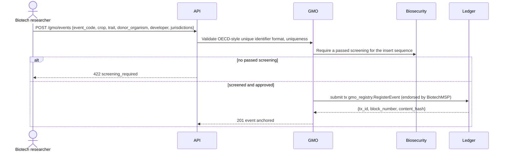
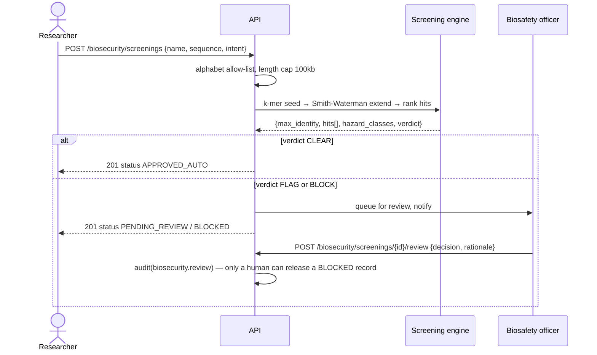
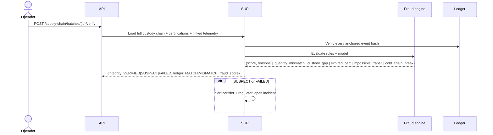
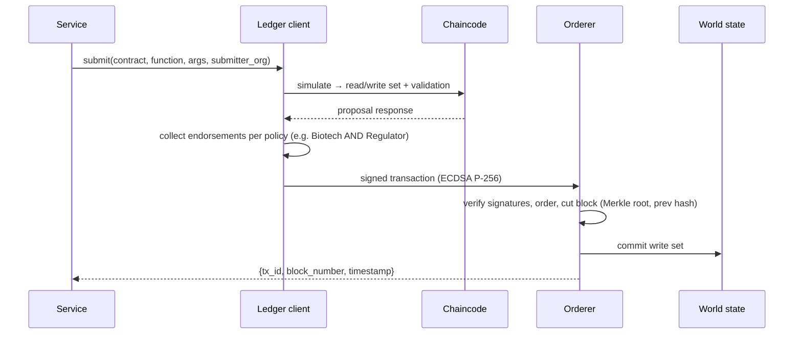
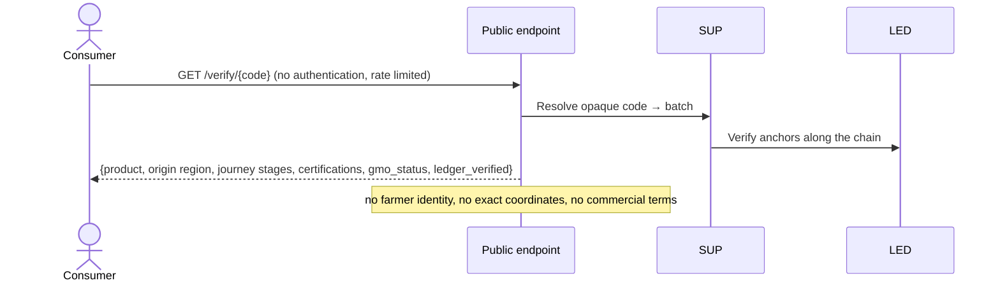

# flow.md — System Workflows

Every workflow below is implemented. Diagrams are Mermaid; participants match the module map in
`Architecture.md` §5.

---

## 1. User registration and approval



## 2. Authentication and token lifecycle



## 3. Authorisation on every request

```
request → resolve token → load principal (id, role, org)
        → route's required permission ∈ role's permission set ?  no → 403 + security log
        → repository applies org scope automatically (ADR-015)
        → unscoped access only for ADMIN/REGULATOR, always audit-logged
```

## 4. Farm registration and farmer onboarding

```
FARM_OPERATOR → POST /farms {name, region, coordinates, area, org}
   → validate geo bounds and area
   → create Farm (org-scoped) → audit(farm.create)
   → POST /farms/{id}/fields → POST /fields/{id}/crops (crop, variety, optional gmo_event)
   → if crop references a GMO event: verify event exists and is approved for this jurisdiction
     → else 422 with the failing rule
```

## 5. IoT device registration and provisioning

```mermaid
sequenceDiagram
    actor O as Farm operator
    participant API
    participant DEV as Device registry
    O->>API: POST /devices {type, model, firmware, farm_id, field_id}
    API->>DEV: Create device (status PROVISIONED)
    DEV->>DEV: secret = secrets.token_hex(32); store bcrypt hash only
    DEV-->>API: device_id + secret (plaintext, once)
    API-->>O: 201 {device_id, device_secret, warning: shown once}
    O->>API: POST /devices/{id}/activate
    API->>DEV: status → ACTIVE
```

## 6. Sensor data ingestion (authenticated telemetry)

```mermaid
sequenceDiagram
    participant D as Device
    participant API
    participant TEL as Telemetry service
    participant AI as Anomaly detector
    participant SEC as Security ops
    D->>API: POST /telemetry/ingest {device_id, ts, nonce, readings, hmac}
    API->>TEL: Load device; reject if unknown/suspended/quarantined/retired
    TEL->>TEL: HMAC-SHA256 over canonical payload, compare_digest
    TEL->>TEL: |now - ts| <= 300s ?  nonce unseen ?  sequence monotonic ?
    alt any check fails
        TEL->>SEC: security_log + failure counter (alert on repetition)
        API-->>D: 401 / 409 replay
    else valid
        TEL->>TEL: Range-validate each reading; quarantine malformed
        TEL->>TEL: Persist (payload AES-GCM at rest), update device health
        TEL->>AI: score(features)
        alt anomaly above threshold
            AI-->>SEC: raise alert (severity by score), link device
        end
        API-->>D: 202 {accepted, anomaly_score}
    end
```

## 7. Satellite imagery and precision-farming pipeline

```
Provider (simulated) → POST /telemetry/satellite/scenes {scene_id, captured_at, field_id, ndvi_stats, checksum}
   → verify checksum, validate ranges, store scene
   → compute field vegetation trend, compare with soil moisture and yield series
   → generate precision-farming insight (zone stress ranking)
   → optional: crop image → CNN → disease classification → agronomy alert
```

## 8. AI analysis (generic)

```
input → typed schema → deterministic feature extraction (versioned)
      → model/rule evaluation → {score, level, reasons[], evidence, model_version}
      → persist AIAnalysis → alert if level ≥ threshold → optional ledger anchor
      → on model failure: fall back to rules, mark degraded, never 5xx
```

## 9. Threat and anomaly detection (device compromise)



## 10. Agricultural data-theft detection

```
every authenticated request → access recorder (principal, route, page_size, entity, hour)
   → rolling baseline per principal
   → signals: volume spike | max page size streak | off-hours | unfamiliar farms |
              repeated exports | failed cross-tenant attempts
   → weighted score ≥ threshold → HIGH alert + incident + optional throttle + audit
```

## 11. GMO registration



## 12. Biosecurity sequence screening



## 13. CRISPR risk assessment and DURC monitoring

```
POST /biosecurity/crispr {target_gene, guide_rna, pam, organism, edit_type, intent}
  → validate guide length/PAM
  → off-target scan against the organism reference (k-mer + mismatch tolerance)
  → weighted risk: target criticality × edit type × off-target count × organism class × intent
  → DURC correlation: hazard class × intent × technique → flag if in the concern matrix
  → verdict {LOW|MODERATE|HIGH|PROHIBITED} + reasons[]
  → HIGH/PROHIBITED → biosafety queue + notification + audit
```

## 14. Seed lot creation and product lifecycle

```
Seed lot (BiotechMSP)  →  planting (FarmMSP)  →  harvest batch (FarmMSP)
   → processing (SupplyMSP) → packaging (SupplyMSP) → shipment (SupplyMSP)
   → receipt/distribution (SupplyMSP) → retail
Each transition: POST /supply-chain/events with EPCIS-shaped {what, when, where, why, quantity}
   → validate lifecycle transition is legal for the current state
   → validate quantity conservation (output ≤ input, loss recorded explicitly)
   → append to chain of custody, anchor to ledger, run fraud scoring
```

## 15. Supply-chain verification and fraud detection



## 16. Certification issuance and authentication

```
CERTIFIER → POST /certifications {type: ORGANIC|NON_GMO|SPECIALTY, scope, subject, valid_from, valid_to, standard}
   → verify issuer authority for that certification type
   → anchor to ledger (certification.Issue)
Authentication at use time:
   → status ACTIVE ? within validity window ? issuer trusted ? scope covers this batch ?
     not conflicted (e.g. NON_GMO on a batch whose lineage contains a GMO event) ?
   → any failure → certification_invalid reason on the batch verification
```

## 17. Blockchain transaction lifecycle



## 18. Blockchain verification

```
GET /blockchain/verify            → replay all blocks: parent hash, Merkle root, every signature
GET /blockchain/verify/{tx_id}    → Merkle inclusion proof for one transaction
POST /blockchain/verify-record    → recompute the entity's content hash and compare to the anchor
                                    → MATCH | MISMATCH (tamper detected) | NOT_ANCHORED
```

## 19. Consumer verification (public)



## 20. Compliance evaluation and reporting

```
POST /compliance/evaluate {batch_id | gmo_event_id, jurisdiction}
  → load applicable rules (USDA / FDA / EU 1829/2003 / Codex / GS1)
  → evaluate each rule against the entity graph → per-rule {pass, evidence, citation}
  → overall status COMPLIANT | NON_COMPLIANT | INSUFFICIENT_DATA
  → persist report, anchor report hash to ledger, notify on failure
GET /compliance/reports/{id}          → full report
POST /compliance/eia                  → environmental impact assessment report
```

## 21. Alert generation and notification

```
source (AI | rules | scheduler) → Alert {severity, category, entity, reasons}
   → Notification fan-out to roles that own the category
   → acknowledge → assign → resolve, each step audited
```

## 22. Incident response

```
Alert (HIGH/CRITICAL) → Incident opened automatically
  → analyst triages → containment action (quarantine device | revoke token family | suspend user)
  → each action is an authorised API call, audited
  → resolution with root cause, linked alerts, and timeline export
```

## 23. Audit logging and verification

```
service action → audit.record(actor, action, entity, before/after summary, ip, correlation_id)
   → entry_hash = SHA256(prev_hash || canonical(entry))
   → periodic anchor of the chain head to the ledger
GET /audit/verify → recompute the chain, report first divergence and the anchored head comparison
```
